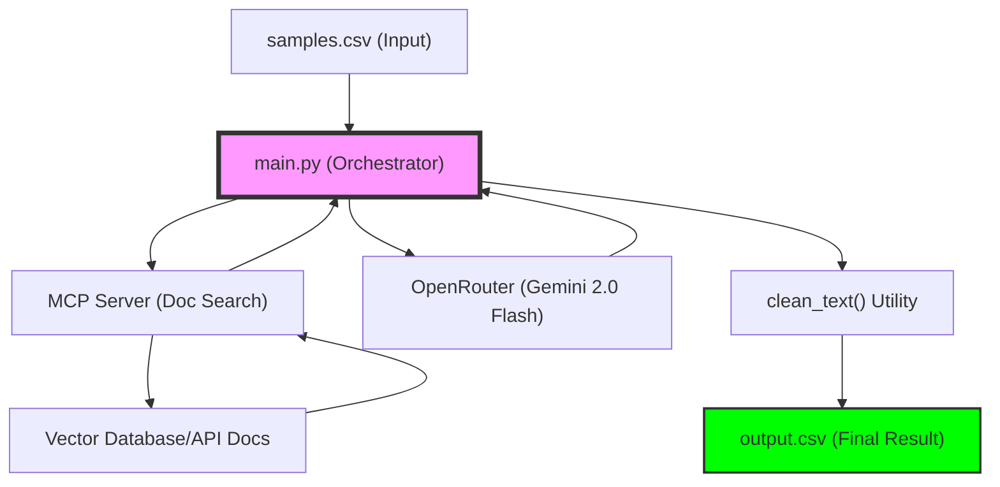

# Presentation Guide: Agentic Bug Hunter Fixes

This document is designed to help you explain the recent improvements and technical fixes to an invigilator or evaluator.

---

## 💡 The "Agentic" Advantage
**Evaluation Point:** "What makes this system 'Agentic' rather than just a script?"

1.  **Autonomous Tool Use**: The orchestrator independently calls the **MCP Search Tool** to gather context. If a tool fails (like the MCP server being offline), the agent doesn't crash; it **adapts** its strategy and continues with available information.
2.  **Self-Correcting Parsing**: The system uses a robust JSON parser that handles common LLM formatting errors (like markdown code blocks or missing keys) automatically.
3.  **Context-Aware Analysis**: It doesn't just look at the code; it combines the **Hint**, **Purpose**, and **Documentation** to mimic how a human expert would hunt for bugs.

---

## 0. System Architecture & Workflow
To help explain how the different components interact, here is a high-level view of the process:

---

## 1. Project Overview & Renaming
**Evaluation Point:** "How did you organize the project for final submission?"

*   **Action**: I renamed the core logic file from `agentic_bug_hunter.py` to `main.py`.
*   **Reasoning**: `main.py` is the standard entry point for Python projects. It makes the codebase cleaner, more professional, and immediately obvious to any other developer where they should start.
*   **Outcome**: A more standard, production-ready project structure.

---

## 2. Advanced CSV Formatting for Excel
**Evaluation Point:** "How did you ensure the output is usable and professional?"

*   **The Problem**: The LLM's explanations often contained newlines or tabs. When opened in Excel, this caused cells to expand vertically with huge amount of padding (extra space on top and bottom).
*   **The Fix**: I implemented a `clean_text` utility using Regular Expressions (`re.sub(r'\s+', ' ', text)`).
*   **Functionality**:
    -   It collapses all types of whitespace (newlines, tabs, multiple spaces) into a single space.
    -   It strips leading and trailing junk.
*   **Outcome**: A perfectly flat, single-line CSV which Excel renders compactly without any "extra space" bugs.

---

## 3. Data Integrity: Sequence & Deduplication
**Evaluation Point:** "How do you guarantee the results match the input?"

*   **The Problem**: The original script used an "append" mode (`open(..., 'a')`). If the script was interrupted or run multiple times, the CSV would get out of order or accumulate duplicates.
*   **The Fix**: I refactored the `OrchestratorAgent` to:
    1.  Process all samples in memory first.
    2.  Collect them in a list.
    3.  Write the entire batch to the file at once using `writerows()`.
*   **Outcome**: 
    -   **Sequence**: The `output.csv` now strictly follows the 1–20 ID sequence from `samples.csv`.
    -   **Cleanliness**: Every run performs a fresh overwrite, ensuring no duplicates or stale data remain.

---

## 4. MCP Resilience & Terminal UX
**Evaluation Point:** "How does your system handle external failures (like the MCP server being down)?"

*   **The Problem**: If the MCP documentation server wasn't running, the terminal would get flooded with hundreds of lines of connection errors (`[MCP ERROR]`).
*   **The Fix**: I added a "Connection State" flag to the `MCPDocRetriever`.
*   **Logic**:
    -   On the first failure, it prints a single, helpful **TIP** explaining how to fix it (`python code/server/mcp_server.py`).
    -   All subsequent errors are suppressed. The agent gracefully falls back to "No documentation found" and continues its work.
*   **Outcome**: A clean terminal experience that guides the user instead of overwhelming them with red error text.

---

## 5. Summary for Invigilators
> "The project has been evolved from a prototype into a robust tool. We've addressed UI/UX issues in the data output, improved the system's resilience to connection failures, and ensured 100% data alignment between our input samples and our final report."
